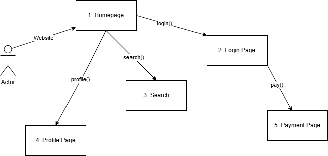

# AIRBNB group 1 project

## Project Vision:
For tourists who looking to rent a place to stay during a vacation or event. 
AirHome is an application that allows users to find suitable housing based on trip 
requirements such as pricing, distance from specified address, & housing conditions
by offering a list of recommended homes. Unlike other vacational rental applications,
that charge overpriced fees, our service is affordable with flexible rates and an easy
to navigate interface.

# User Requirements
    Product Reviews - Customers should be able to leave reviews
    their experience of staying at a given place 

# Functional Requirements
    Home Page 
    ID: FR1
    Name: Homepage
    Description: The main landing page for the user
    Primary actor: Developer 1

    Login Page 
    ID: FR2
    Name: Login Page
    Description: A page that allows users to login
    Primary actor: Developer 1

    Searching
    ID: FR3
    Name: Searching feature
    Description: Ability to search for different places to stay
    Primary actor: Developer 1

    
    Profile page
    ID: FR4
    Name: Profile Page
    Description: A page that shows the profile of the user
    Primary actor: Developer 1

    Payment Page 
    ID: FR5
    Name: Payment Page
    Description: A page that allows users to make payments
    Primary actor: Developer 1

# Non-Functional Requirements

    Security   
    ID: NFR1
    Name: Security
    Description: The data of the user should be encrypted for security
    Primary actor: Developer 1

    Scalablity
    ID: NFR2
    Name: Scalablity
    Description: available for different regions
    Primary actor: Developer 1

    
    Sustainable 
    ID: NFR3
    Name: Sustainable
    Description: It should be up and available 98% of the time
    Primary actor: Developer 1
    
    Usability 
    ID: NFR4
    Name: Usability
    Description: Take no longer than 5 seconds to login
    Primary actor: Developer 1

    Maintainable
    ID: NFR5
    Name: Maintainable
    Description: Have helpful error messages
    Primary actor: Developer 1

